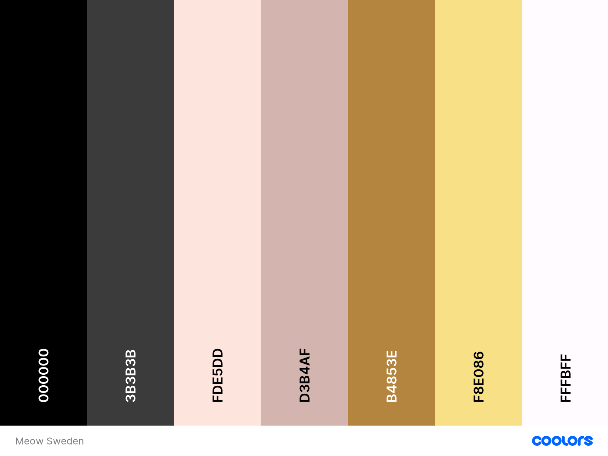
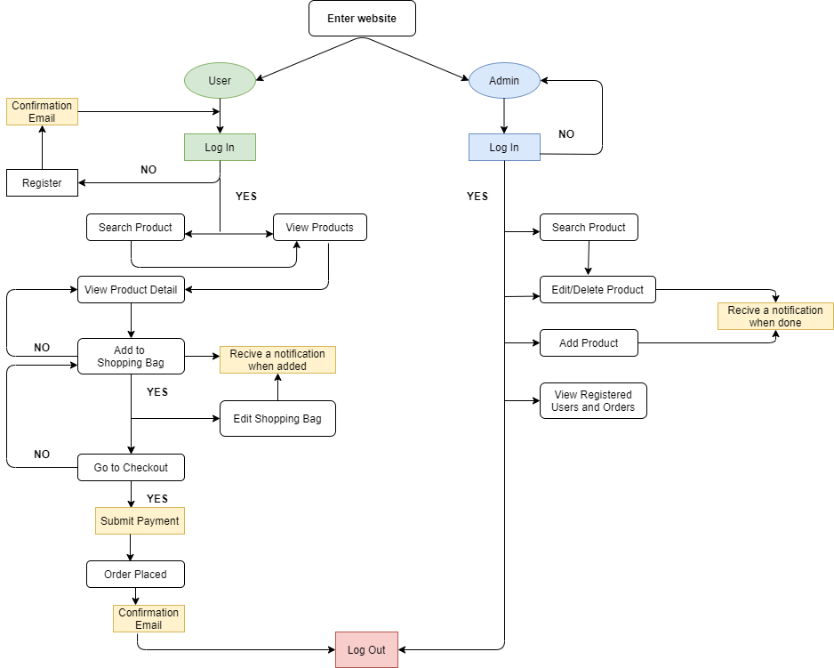
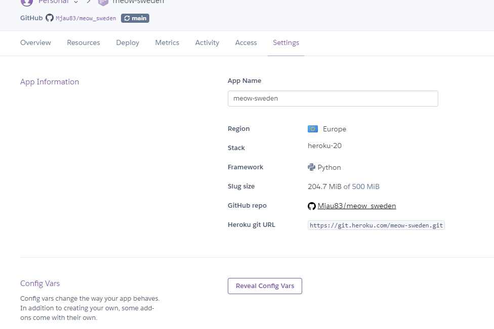

# Meow Sweden
### Handmade accessories and jewelry with cattitude =^.^=


## Project Goals
**What is it?** 
Meow Sweden is a webshop that provides handmade fancy and luxurious cat ears for all crazy catladies with a sence of fashion. Here can the cat fashionista be sure to find sparkely cat ears in different colors and styles. There is also a jewelry section with necklaces made with ancient Quipu code.

**Who is it for?**
For any catlover, male or female (yes, men can be catladies too), that like to level up their outfit.

**Why am I building it?**
This project is actually why I got into coding. I started up Meow Sweden in spring 2019 and started selling my cat ears and necklaces on **[Etsy](https://www.etsy.com/se-en/shop/MeowSweden?ref=seller-platform-mcnav)**. But I always felt like Meow Sweden should have its own homepage with it own webshop. And with this project I can finaly dive into how I would like it to be! And I can get full controll over all the design and all the functionallity.

***Brief footnote**
During the building of this project Gitpod experienced some issues where workspaces where stuck in "Stopped". Due to this issue updates and files were lost several times. As you look through the commits you may find traces of this as files had to be recreated and updated again.

## Table of Content

* [**UX**](#ux)
    * [User Goals](#user-goals)
    * [User Stories](#user-stories)
    * [Site Owner Goals](#site-owner-goals)
    * [Design](#design) 
* [**Wireframes and Flowcharts**](#wireframes-and-flowcharts)
    * [Wireframes](#wireframes)
    * [Flowcharts](#flowcharts)
* [**Database Structrue**](#database-structure)
* [**Features**](#features)
* [**Technologies Used**](#technologies-used)
    * [Languages](#languages)
    * [Frameworks Libraries Programs](#frameworks-libraries-programs)
* [**Testing**](#testing)
    * [Bugs](#bugs)
    * [To Do](#to-do)
* [**Deployment**](#deployment)
    * [GitHub Pages](#gitHub-pages)
* [**Credits**](#credits)


## UX

### User Goals
* The website should be visually appeling 
* The website should work well on all devices
* The ladingpage should display some products making user motivated to continue browsing
* The users should be able to make a purchase
* The website should have some background informaion about the company

### User Stories

* As a user I want to be able to browse through the products by category
* As a user I want to be able to easily navigate the website
* As a user I want to be able to search for products
* As a user I want to see images and information of the product
* As a user I want to able to choose from a selection of colors when I buy some products 
* As a user I want to create a customer profile 
* As a user I want to be able to log in to that profile, and log out
* As a user I want to be able to view my shopping bag with added products and/or edit/delete it
* As a user I want to be able to pay for my order with a credit card
* As a user I want to recive a confirmation email when I make an order

### Site Owner Goals
* As a site owner I want to promomte my products to my users
* As a site owner I want to be able to see all the orders
* As a site owner I want to be able to see all registered users
* As a site owner I be able to log in and out of the admin profile
* As a site owner I want o be able to edit and delete products
* As a site owner I want o be able to add new products to the webshop


### Design

#### Fonts:

I used fonts from [Google Fonts](https://fonts.google.com/)
* [Cormorant Garamond](https://fonts.google.com/specimen/Cormorant+Garamond?query=cor) on h1
* [Raleway](https://fonts.google.com/specimen/Raleway?query=rale) on h2/h3
* [Roboto](https://fonts.google.com/specimen/Roboto) on paragraphs

#### Images:

All product images are me own and was photographed my me. Background images are from [Adobe](www.stock.adobe.com)

#### Color: 

I wanted to use colors that match background images and giving the website a luxurious feeling with some gold.



[Back to top](#table-of-content)


## Wireframes and Flowcharts
### Wireframes
[Balsamic](https://balsamiq.com) was used to create the wireframes for this project

* Desktop Wireframes
    * [HOME](wireframes/HOME-DeskTop.png)
    * [Products](wireframes/Products-DT.png)
    * [Product Detail](wireframes/ProdDetail-DT.png)
    * [About](wireframes/About-DT.png)
    * [Contact](wireframes/Contact-DT.png)
    * [Profile](wireframes/Profile-DT.png)
    * [Shopping Bag](wireframes/View-Shopping-Bag-DT.png)
    * [Checkout](wireframes/Checkout-DT.png)

    
* Tablet Wireframes
    * [HOME](wireframes/HOME-Tablet.png)
    * [Products](wireframes/Products-T.png)
    * [Product Detail](wireframes/ProdDetail-T.png)
    * [About](wireframes/About-T.png)
    * [Contact](wireframes/Contact-T.png)
    * [Profile](wireframes/Profile-T.png)
    * [Shopping Bag](wireframes/View-Shopping-Bag-T.png)
    * [Checkout](wireframes/Checkout-T.png)

* Smartphone Wireframes 
    * [HOME](wireframes/HOME-SmartPhone.png)
    * [Products](wireframes/Products-SP.png)
    * [Product Detail](wireframes/ProdDetails-SP.png)
    * [About](wireframes/About-SP.png)
    * [Contact](wireframes/Contact-SP.png)
    * [Profile](wireframes/Profile-SP.png)
    * [Shopping Bag](wireframes/View-Shopping-Bag-SP.png)
    * [Checkout](wireframes/Checkout-SP.png)

### Flowcharts
I used [Draw.io](https://app.diagrams.net/) to make a flowchart so I could get a better understanding of what happens when on the site for both the Admin User and Registered custom User.



[Back to top](#table-of-content)

## Database Structure

### Category
**Name** | **Database Key** | **Field Type** | **Validation**
------------ | ------------- | ------------- | -------------
Name | name | CharField | max_length=200
Friendly Name | friendly_name | CharField | max_length=200, null=True, blank=True

### CatEarColor
**Name** | **Database Key** | **Field Type** | **Validation**
------------ | ------------- | ------------- | -------------
Cat ear color | catear_color | CharField | max_length=2, choices=CATEAR_COLOR, default=BLUE

### QuipuForm
**Name** | **Database Key** | **Field Type** | **Validation**
------------ | ------------- | ------------- | -------------
Quipu color | quipu_color | CharField | max_length=2, choices=QUIPU_COLOR, default=PEARL_WHITE
Quipu stone pearl | quipu_stone_pearl | CharField | max_length=2, choices=QUPIU_STONE_PEARL, default=LABRADORITE
Name field | name_field | CharField | max_length=12


### Products
**Name** | **Database Key** | **Field Type** | **Validation**
------------ | ------------- | ------------- | -------------
Category | category | ForeignKey | 'Category', null=True, blank=True, on_delete=models.SET_NULL
SKU | sku | CharField | max_length=200, null=True, blank=True
Name | name | CharField | max_length=200
Description | description | TextField| 
Cat ear color option | catear_color_option | ManyToManyField | 'CatEarColor'
Cat ears has colors| catears_has_colors | BooleanField | default=False, null=True, blank=True
Quipu custom form | qupiu_custom_form | BooleanField | default=False, null=True, blank=True
Price | price | DecimalField | max_digits=6, decimal_places=2
Image URL | image_url | URLField | max_length=1024, null=True, blank=True
Image | image | ImageField| null=True, blank=True

### Order
**Name** | **Database Key** | **Field Type** | **Validation**
------------ | ------------- | ------------- | -------------
Order Number | order_number | CharField | max_length=32, null=False, editable=False
Status | status | CharField | max_length=20, null=True, choices=STATUS, default='Pending'
User profile | user_profile | ForeignKey | UserProfile, on_delete=models.SET_NULL, null=True, blank=True, related_name='orders')
Full Name | full_name | CharField | max_length=50, null=False, blank=False
Email | email | EmailField | max_length=254, null=False, blank=False
Street Address 1 | street_address1 | CharField | max_length=80, null=False, blank=False
Street Adress 2 | street_address2 | CharField | max_length=80, null=True, blank=True
Town/City | town_or_city | CharField | max_length=40, null=False, blank=False
Post Code | postcode | CharField | max_length=20, null=True, blank=True
Country | country | CountryField | blank_label='Country *', null=False, blank=False
Date | date | DateTimeField | auto_now_add=True
Delivery Cost | delivery_cost | DecimalField | max_digits=6, decimal_places=2, null=False, default=0
Order Total | order_total | DecimalField | max_digits=10, decimal_places=2, null=False, default=0
Grand Total | grand_total | DecimalField | max_digits=10, decimal_places=2, null=False, default=0
Original Bag | original_bag | TextField | null=False, blank=False, default=''
Stripe PayID | stripe_pid | CharField | max_length=254, null=False, blank=False, default=''

### OrderLineItem
**Name** | **Database Key** | **Field Type** | **Validation**
------------ | ------------- | ------------- | -------------
Order | order | ForeignKey | Order, null=False, blank=False, on_delete=models.CASCADE, related_name='lineitems'
Product | product | ForeignKey | Product, null=False, blank=False, on_delete=models.CASCADE
Catear Color | catear_color | CharField | max_length=20, null=True, blank=True 
Quipu color choise | quipu_color_choise | CharField | max_length=100, null=True, blank=True
Quantity | quantity | IntegerField | null=False, blank=False, default=0
Lineitem Total | lineitem_total | DecimalField | max_digits=6, decimal_places=2, null=False, blank=False, editable=False

### UserProfile
**Name** | **Database Key** | **Field Type** | **Validation**
------------ | ------------- | ------------- | -------------
User | user | OneToOneField | User, on_delete=models.CASCADE
Street Address 1 | default_street_address1 | CharField | max_length=80, null=True, blank=True
Street Adress 2 | default_street_address2 | CharField | max_length=80, null=True, blank=True
Town/City | default_town_or_city | CharField | max_length=40, null=True, blank=True
Post Code | default_postcode | CharField | max_length=20, null=True, blank=True
Country | default_country | CountryField | blank_label='Country *', null=True, blank=True

## Features
* Responsive on different devices
* Registration and log in for Customer Users
* Possability to edit Customer profile and view order history when logged in
* Browse products by category
* Possability for Admin User to add, edit and delete products when logged in

[Back to top](#table-of-content)


## Technologies Used
### Languages
* [HTML5](https://en.wikipedia.org/wiki/HTML5)
* [CSS3](https://en.wikipedia.org/wiki/CSS)
* [JavaScript](https://en.wikipedia.org/wiki/JavaScript)
* [Python](https://en.wikipedia.org/wiki/Python_(programming_language))

### Frameworks and Libraries 
* [Django](https://www.djangoproject.com/) was used for framework
* [Google Fonts](https://fonts.google.com/) was used to import the fonts mentioned above 
in the project
* [Coolors](https://coolors.co/) was used to decide on th colors and to create the color 
palette
* [Am I Responsive](http://ami.responsivedesign.is/) was used to make the mockup
* [Bootstrap](https://getbootstrap.com/) was used to make the site responsive
* [Font Awsome](https://fontawesome.com/) was used for the icons
* [Stripe](https://stripe.com/) was used to create payment infrastructure

### Tools
* [Balsamic](https://balsamiq.com) was used to create wireframes in the beginning of 
the project
* [Draw.io](https://app.diagrams.net/) was used to make the flowchart
* [Material.io](https://material.io/) was used to check that the contrast is ok
* [Gimp](https://www.gimp.org/) was used to edit photos.
* [Favicon.cc](https://www.favicon.cc/) was used to create the fave icon
* [Webformatter](https://webformatter.com/html) was used to beautify the code
??* [Copressor.io](https://compressor.io/) was used to compress the background image
* [Heroku](https://id.heroku.com/login) was used to deploy and host the site
* [Gitpod](https://gitpod.io/) was used for coding the project
* [Github](https://github.com/) was used to save and stored on the project after being 
pushed from Gitpod.
* [AWS S3 Bucket](https://aws.amazon.com/s3/) was used for storing static and media files

[Back to top](#table-of-content)


## Testing
You can read all about the testing of this site [Here](TESTING.md)

[Back to top](#table-of-content)


## Bugs

**Page content bug**
* **The main content of the pages is hidden underneith the main nav so the top of the page isn't visable**

* **Fix**

Added padding-top to the content container for the pages and matched it for media queries.

* **Verdict**

All content is is now visable on all pages

**Webhook bug**
* **When trying to send a test webhook from Stripe I get "Bad Request checkout/wh/" printed in the terminal and a 400 http response**


* **Fix**

I needed to edit the enviormental variable for STRIPE_WH_SECRET to target this project specificlay as it was trying to work with other projects as well. After restarting the workspace Gitpod changed the servername from *eu14* to *eu13*. I changed the endppoint UR in Stripe, but it still didn't work. So I created env.py and added the STRIPE_WH_SECRET there, then in settings.py
```
if os.path.exists("env.py"):
    import env
```


* **Verdict**

The checkout now works as planed. Thank you to tutor Igor for helping me and explaining.

**Products database bug**
* **Non of the uploaded product will show**

Text

* **Fix**

Text

* **Verdict**

Text

**Bag bug**
* **Selected options won't show in the bag**

Text

* **Fix**

Text

* **Verdict**

Text

[Back to top](#table-of-content)


## To Do
* 
* 
* 

[Back to top](#table-of-content)


## Deployment

For this project you will need to account on the following pages
* [Gmail](https://www.google.com/intl/sv/gmail/about/) for sending emails
* [AWS (S3)](https://aws.amazon.com/) for storing staic files
* [Stripe](https://stripe.com/) for payment functionallity


I used [Github](https://github.com/) to create the Meow Sweden project, [Gitpod](https://gitpod.io/) was used to write the code and [Heroku](https://id.heroku.com/login) to deploy it. You will need to install packages using pip. 
[Go to the Python Guide](https://packaging.python.org/guides/installing-using-pip-and-virtual-environments/) to find documentation about this.

### Local Deployment
1. In the rrepository, click the "code" button with a small arrow and download the zip with the code. You can also clone the repository your terminal printing:

```
git clone https://github.com/Mjau83/meow_sweden.git
```


2. To install the applications print the following in the terminal

```
pip3 install -r requirements.txt
```

3. At root level in the project, create a file called env.py and make sure it's added to your .gitignore file. The file should contain:

```
os.environ["STRIPE_PUBLIC_KEY"] = "YOUR_STRIPE_PUBLIC_KEY"
os.environ["STRIPE_SECRET_KEY"] = "YOUR_STRIPE_SECRET_KEY"
os.environ["STRIPE_WH_SECRET"] = "YOUR_STRIPE_WH_SECRET"
os.environ['DEVELOPMENT'] = '1'
os.environ['DATABASE_URL'] = 'YOUR_postgres_KEY'
os.environ['EMAIL_HOST_USER'] = 'youremail@mail.com'
```
4. In the Gitpod dashboard go to Settings > Variable and create new envorimental variables for 

* STRIPE_PUBLIC_KEY
* STRIPE_SECRET_KEY
* STRIPE_WH_SECRET

Public and Secret key can be used for many projects, but WH Secret for the webhook needs to be set for this specific project. Go to the [Stripe documentataion](https://stripe.com/docs/keys) about API Keys to find out more.


5. Migrate the database model by printing

```
python3 manage.py makemigrations
python3 manage.py migrate
```
6. Create a superuser and set up the credentials by using

```
python3 manage.py createsuperuser
```

To login with the superuser and access the django admin add */admin* at the end of the URL in the browser when you run the project


7. To run the project in the browser print
```
python manage.py runserver
```

### Heroku Deployment
1. Login to your Heroku account and create a new app. Choose your region.
2. Once the app is created go to the *Resources* tab and under Add-ons, look for the Heroku Postgres to attach a postgres database to your project. Select *Hobby Dev - Free plan* and click 'Submit order form'
3. Click on the *Settings* tab. Scroll down and click "Reveal config vars". 

Here you can set up the same variables as in your env.py. DON'T set the DEBUG variable in under config vars, only in your env.py to prevent DEBUG being active on live website. Set up the following variables in **Heroku** :

```
AWS_ACCESS_KEY_ID = "YOUR_AWS_ACCESS_KEY_ID"
AWS_SECRET_ACCESS_KEY = "YOUR_AWS_SECRET_ACCESS_KEY"

DATABASE_URL = "YOUR_postgres_KEY" (This variable is automatically set when adding Postgres)

EMAIL_HOST = "yourmail@mail.com"
EMAIL_HOST_PASS = "YOUR_EMAIL_HOST_PASS"

SECRET_KEY = "SECRET_KEY"
STRIPE_PUBLIC_KEY = "YOUR_STRIPE_PUBLIC_KEY" (Same as your envorimental variables)
STRIPE_SECRET_KEY = "YOUR_STRIPE_SECRET_KEY" (Same as your envorimental variables)
STRIPE_WH_SECRET = "YOUR_STRIPE_WH_SECRET" (Same as your envorimental variables)

USE_AWS = True
```

4. Copy the value of DATABASE_URL and past it into you env.py
5. In the project folder meow_sweden open settings.py and set your DATABASES to the following. This will be removed later.

```
DATABASES = {
    'default': dj_database_url.parse('YOUR_postgres_KEY'))
}
```
6. To make a migration print these commands

```
python3 manage.py makemigrations
python3 manage.py migrate
```

7. Create a superuser for the postgres database so that you can have access to the django admin. You will need to log in to the admin page to check the boxes 'Verified and primary" under the Emails section.
```
python3 manage.py createsuperuser
```

8. Load the data from the .json files into the database by using the following this command for each file. Make sure to load the categories first!
* categories.json
* products.json

```
python3 manage.py loaddata <name of .json file >
```

9. After migrations and loading data, change database configurations in settings.py to:

```
if 'DATABASE_URL' in os.environ:
    DATABASES = {
        'default': dj_database_url.parse(os.environ.get('DATABASE_URL'))
    }
else:
    print("SQLite")
    DATABASES = {
        'default': {
            'ENGINE': 'django.db.backends.sqlite3',
            'NAME': os.path.join(BASE_DIR, 'db.sqlite3'),
        }
    }
```
### To allow your site to use Postgres and sqlite3 in development and deployment
1. Make sure the requirements.txt is up to date and that you have created the Procfile.

For requirements:
```
pip3 freeze --local > requirements.txt
```
For Procfile:
```
echo web: python app.py > Procfile
```
2. In the Procfile add

```
web: gunicorn <project_name>.wsgi:application
```

3. To add files and commit them to Github run:
```
git add . 
git commit -m "Your commit message"
git push
```

4. Add your Heroku app URL to ALLOWED_HOSTS in your settings.py file
```
ALLOWED_HOSTS = ['your-app-name.herokuapp.com', 'localhost']
```

5. In HEROKU and click the *Deploy* tab in the navigation, scroll down and select Github
6. Search for your repoitory and click Connect
7. Under automatic deploys, click 'Enable automatic deploys'
8. When the build is completed, click "view app" to open it
9. To commit your changes to the branch, use *git push* to push your changes
10. Your static files and media files will be stored on AWS. To find more information about this go to [Amazon S3 Documentation](https://docs.aws.amazon.com/AmazonS3/latest/userguide/Welcome.html) 
11. To set up the email service for confirmation/varification Gmail is used. Go to your gmail account and go to *Settings* (gear icon in the top right)
12. Go to Accounts and Imports tab and click on Google account settings, then go Security
13. Scroll down to "Signing in to Google" and turn on 2-step varification
14. This creates a app password that you can add in the Heroku config variables

* EMAIL_HOST_USER = 'yourmail@gmail.com'
* EMAIL_HOST_PASS = 'YOUR_EMAIL_HOST_PASS' (The password you just got)

15. In settings.py add the following: 
```
if 'DEVELOPMENT' in os.environ:
    EMAIL_BACKEND = 'django.core.mail.backends.console.EmailBackend'
    DEFAULT_FROM_EMAIL = 'your_default_mail@example.com'
else:
    EMAIL_BACKEND = 'django.core.mail.backends.smtp.EmailBackend'
    EMAIL_USE_TLS = True
    EMAIL_PORT = 587
    EMAIL_HOST = 'smtp.gmail.com'
    EMAIL_HOST_USER = os.environ.get('EMAIL_HOST_USER')
    EMAIL_HOST_PASSWORD = os.environ.get('EMAIL_HOST_PASS')
    DEFAULT_FROM_EMAIL = os.environ.get('EMAIL_HOST_USER')
```

[Back to top](#table-of-content)

## Credits
#### Inspiration 
* [Dennis Ivy](https://www.youtube.com/watch?v=xv_bwpA_aEA&list=PL-51WBLyFTg2vW-_6XBoUpE7vpmoR3ztO )
* [ ]( )

* Many thanks to the awsome people at Tutor Support. Especally **Igor Basuga** and **Seán Murphy**. They both went  far and beyond when I needed it the most. They helped me get back on track, took their time explaining and showed a great amount of patinece. I truly, truly appreciate it.
* A huge thank you to my mentor **Simen Eventyret_mentor** for all the good advices, feedback 
and for challangeing me to always do better.
* Thank you to my older brother **David** who’s been a wonderful support and helped me with testing and good advices.
* Thank you to my friend **Christoffer Nicklasson**, who helped me answering questions and come up with solutions.


[Back to top](#table-of-content)