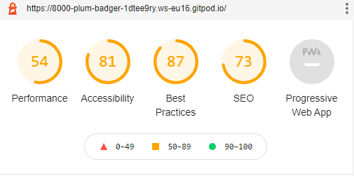
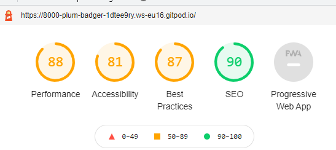

# Testing

## Table of Content

* [**Testing**](#testing)
    * [Validators](#validators)
    * [Lighthouse](#lighthouse)
    * [User Stories](#user-stories)
    * [Site Owner Goals](#site-owner-goals) 

The was tested for Android on Samsung A50 and Xperia 10. It was also tested on laptop
and desktop view (PC).
## Validators
The code was tested with:
* [W3C Markup Validator](https://validator.w3.org/)
* [W3C CSS Validator](https://jigsaw.w3.org/css-validator/)

## Lighthouse

* Test 1

* Test 2

## User Stories

### User Stories

* As a user I want to be able to browse through the products by category
* As a user I want to be able to easily navigate the website
* As a user I want to be able to search for products
* As a user I want to see images and information of the product
* As a user I want to able to choose from a selection of colors when I buy some products 
* As a user I want to create a customer profile 
* As a user I want to be able to log in to that profile, and log out
* As a user I want to be able to view my shopping bag with added products and/or edit/delete it
* As a user I want to be able to pay for my order with a credit card
* As a user I want to recive a confirmation email when I make an order

## User Stories
**As a user I want to, be able to browse through the products by category**

* Test

When *Products* is clicked in the navbar a dropdown appears and all the product categories are visable. The user also have the option to chose "All products" and all products will be shown. When one product category is picked the name of the category is show at the top of the page. If the user tries to search for a category all products in that category is displayed. The category dropdown is shown when the product link is clicked in the mobile view as well.

* Result

All categories are show when clicked and display the specific products for that category

* Verdict 

The functionality for the Categories works as expected

**As a user I want to, be able to easily navigate the website**

* Test

Navbar is clearly visable at the top and is fixed so that it's always visable when the page is scrolled. The navbar collapses into a hamburger icon on smaller screens and the likns to the navbar is accessable when it's clicked. In the navbar the user have a clear view of the shopping bag, and when clicked the user can get a view of the item in the bag. The footer at the bottom provides links to the social media accounts. When browsing the products the user can access each item by clicking on it and for there make a purchase. If the user wants to continue shopping a button will take them back to the products, or the user can go to checkout.

* Result

The links on the page takes the user to all the different pages. The buttons help guiding the user to make their next decision. 

* Verdict 

The navigation works as planed

**As a user I want to, be able to search for products**

* Test

If I try to search for a word in a product titel, like "catears" or "necklace", 
products with those words in the title shows up. I can also make a search for something like 
"small" and all products with that word in the description shows up. 

* Result

The user can search for both words in the title and in the description and products are displayed.

* Verdict 

The search function works as planned

**As a user I want to, see images and information of the product**

* Test

When the Products tab i clicked in the navbar and the user have selected a category or
all products, the products are displayed. The are shown with a image and a title that gives a short
description about the product, it tells what category it belongs to and the price is shown. When a product
is clicked the user gets a description that tells a bit more about the product. A bigger image is shown and 
it can be open in a new tab for bigger view

* Result

The products are shown in a clear way for the user. The can get an overview of the products and learn more about
each item when they are clicked. Images shows the product so that the user knows what it looks like

* Verdict 

The products are shown as planed

**As a user I want to, able to choose from a selection of colors when I buy some products**

* Test

When clicking on some of the catears to view the product info a dropdown with color option is displayed. 
The user can chose from a couple of colors and select the one they like. When the product is added to the bag the chosen color is also added so that the user can see the color of the product they have chosen. When going to checkout the chosen color is visable and it's added to the order and can be viewd when the admin user is looking at the order

* Result

The user can easily pick the prefered color if a product offers that option. The user can see the cosen color throughout the whole process of making a purchase

* Verdict 

The dropdown for color opions works as planned 

**As a user I want to create a customer profile**

* Test

By navigating to the *Profile* Paw button the user can either Sign in if the user is already registerd. If not, the user can click on "Register" to fill out the form. A verification email is sent to the given email address and the user gets a link that needs to be clicked to verify the registration. When the verification is done the user can log in and fill out the address form which will be saved for future orders. When a order is made it is saved in the profile so that the user can go back and view it.

* Result

When the user register a email is sent and the verification can be completed. When the profile is updated a notation popps up to notify that updates have been made. When a order is done it gets added to the profile.

* Verdict 

The user registration and and storing of user information and orders in the user profile works as planned

**As a user I want to be able to log in to that profile, and log out**

* Test

After the user have regitered and recived the verification email, the user uses the user name and the password given at registration to log in. To log out the user the user clicks on the Paw and choses "Log out" in the dropdown menu. A notification is shown asking the user if they are sure they want to log out. Clicking Log out takes the user to the home landing page of the site and a noticifation popps up to tell them that they have logged out.

* Result

The for to log in is simple and straight forward. After logging the user can access the user profile and logging out is just as simple as logging in. Notifications are shown when either are done and makes everything extra clear.

* Verdict 

Logging in and out worked as planned. 

**As a user I want to be able to view my shopping bag with added products and/or edit/delete it**

* Test

When the user have added products to the shopping bag they can click on the Bag icon in the top right corner. When a product is added the price adds to the total amount. In the shopping bag view the user can see every product, quantity, and if there's a color option they can see what color they picked. Ther's also a possibility to edit the quantity och an item or remove it completly from the bag. When either of them is done a notification popps up to tell the user what has been done. In the bag view the user have to option to Keep shopping or proceed to Checkout

* Result

The shopping bag gives a clear view of all the items added into the bag. It is easy for the user to update the quantity or remove an item from the bsg. When either of them is done the total amount updates accordingly.

* Verdict 

The shopping bag funtionallity worked as planned

**As a user I want to be able to pay for my order with a credit card**

* Test

When the user clicks on Checkout in the Shoppping bag view they can see a summary of the order. If the user is logged in and have save their address the address is prefilled and the card details is the only thing that needs to be filled out. Before completeing the order the user have the option to adjust the bag if they want to change something. When the order is completed a summary is shown with a uniqu order number, all the items, total price and address.  A confirmation mail is sent with the order information.

* Result

The prefilled user information is in the order form if the user is logged in and it's easy to for the user just to fill out the card details and complete the order. A suammry of the order is shown and it geta adde to the order history in the profile. The payment is registered as "Succeeded" on Stripe payments

* Verdict 

The card payment worked as planned

**As a user I want to recive a confirmation email when I make an order**

* Test

A temporary email address from [Temp Mail](https://temp-mail.org/) was used to create and registrating a test user. When registration was done a verification email was sent to the temporary email and the registration could be completed. After completeing a order however no confirmation email was recived.  

* Result

At the time of writing this however, no orderbconfirmation mail seem to hav been sent to the temporary test email. 

* Verdict 

Verification mail at registration worked as planned, but not the confirmation email

## Site Owner Goals

### Site Owner Goals
* As a site owner I want to promomte my products to my users
* As a site owner I want to be able to see all the orders
* As a site owner I want to be able to see all registered users
* As a site owner I be able to log in and out of the admin profile
* As a site owner I want o be able to edit and delete products
* As a site owner I want o be able to add new products to the webshop

**As a site owner I want to promomte my products to my users**

* Test

When the user enter the landing home page there's a image slider showing a small selection of products. On the Products page the user can sort how they want the products to be displayed. For example name, price or category, high to low or low too high. 

* Result

The products can either be shown all of them at ones, or filtered with help of the sort bar at the top of the products page, or by category or searching. 

* Verdict 

The products are shown as planned

**As a site owner I want to be able to see all the orders**

* Test

By typing */admin* at the eng of the URL the admin if not ready logged in is taken to the Django admin login page. The admin can log in with hel of the superuser details that were set when the project was created. When logged in the admin can click on "Orders" under the Checkout section to the left on the screen. This displays a list of all orders made. The orders are shown with their unique order number with the most recent order at the top. To view details about a specific order the order number is clicked and all information about what was ordered and the user is displayed. The order can then be set to "Pending/Processing/Shipped" to keep track of it. 

* Result

As I site owner I am able to get a clear view of all the orders made. I am able to edit and/or delete them, and I can keep track of their status to make sure nothing is missed out.

* Verdict 

The order admin worked as planned

**As a site owner I want to be able to see all registered users**

* Test

When logged in to the Django admin I as a site owner can navigate to "Users" to get a list of all the users that is registered. The users are displayed by user name in the list, and when clicked more detailed information is shown. It is also posible to see when the user registered and was last logged in.

* Result

All the users are listed and information about each user can be accessed

* Verdict 

The access to the users worked as planned

**As a site owner I be able to log in and out of the admin profile**

* Test

The admin user can either use the same log out method as the customer users, by clicking on the Paw and chose Log out. If the admin is in the Django admin there's a Log out link in the top right corner of the page. That way the admin user can exit the admin view

* Result

There's two ways of logging out from the admin, both are working

* Verdict 

Logging out worked as planned

**As a site owner I want o be able to edit and delete products**

* Test

When a product is displayed there's two options at the bottom of each item. The options "Edit product" and "Delete product" is visable both when many products are shown and in the product info view. When Edit is clicked is opens a *Product Admin* that makes it possible to edit all the fields of the product. When a product is edited a notification popps up to confirm that all went well. If Delete is clicked the product is deleted and a notificaton popps up to confirm that it's done.

* Result

It is easy as a site owner to access the product admin to edit/update a product. It is also easy to delete a product if it shouldn't be in stock any more.

* Verdict 

The edit and delete functions worked as planned

**As a site owner I want o be able to add new products to the webshop**

* Test

By clicking on the Paw and then clicking on *Product Managment* the site owner can add a new product to a form. The category is selected from a dropdown field, product information is added to the form and a image can be uploaded. The new product is displayed with the rest of the products on the page.

* Result

In Product Management it is easy to fill out the field with the product information. The image is esay to upload from the computer.

* Verdict 

The adding of a new product worked as planned